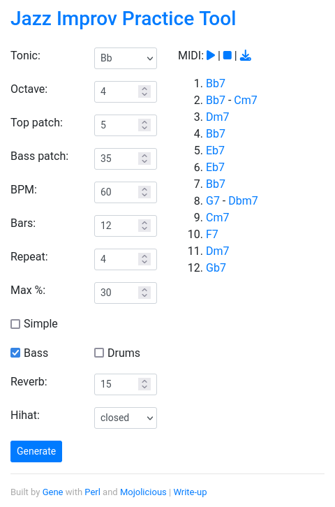

# Jazz::Tool

Blues-Jazz (Jazz-Blues?) Improv Practice Tool

This is a 12-bar oriented practice tool. That is, it's made to play groups of 12 bars. So 24 or 36, etc. measures make more sense than any other multiple. However, Jazz is freeform by nature. So YMMV.

